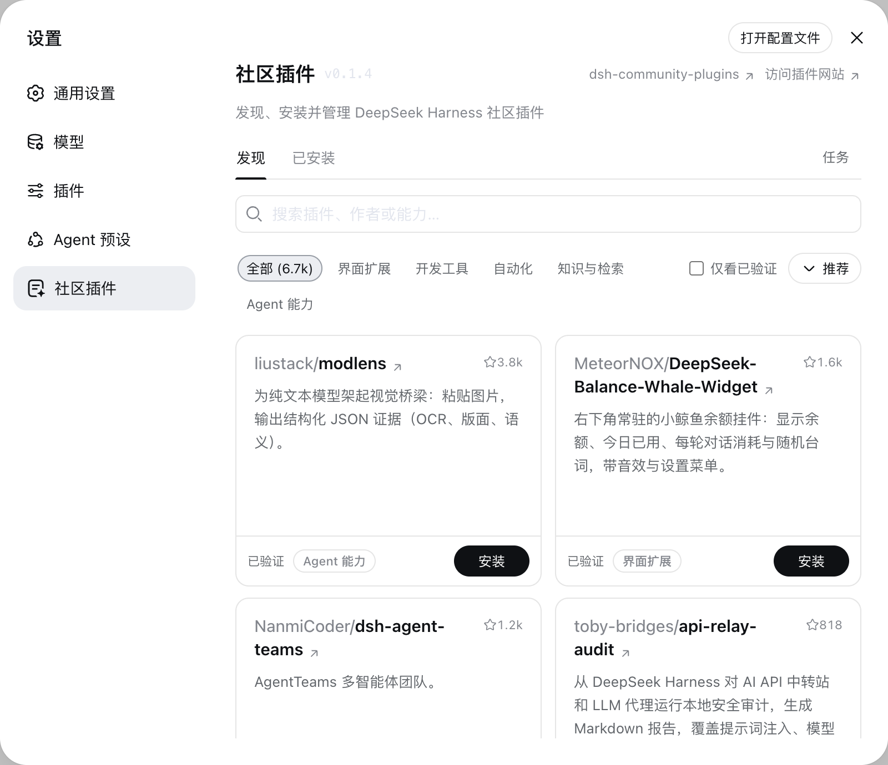

<p align="center">
  
</p>

<p align="center">
  <strong>Discover community plugins. Extend DeepSeek Harness.</strong><br>
  Search, install, update, and manage plugins right from Settings.
</p>

<p align="center">
  <a href="https://github.com/funcodingdev/dsh-community-plugins/actions/workflows/ci.yml"></a>
  <a href="./LICENSE"></a>
  
</p>

<p align="center">
  <a href="./README.md">简体中文</a> ·
  <a href="https://dshpluginhub.com/">Visit plugin website</a> ·
  <a href="https://github.com/funcodingdev/dsh-community-plugins/issues">Report an issue</a>
</p>



## Features

- **Discover plugins**: Search by name, author, or functionality, browse categories, and filter for verified plugins.
- **Choose your sort order**: Find plugins by Recommended, Recently updated, or Most Stars.
- **Browse smoothly**: Load more cards as you scroll, with search and categories always visible at the top.
- **Manage in one place**: Install, update, uninstall, enable, or disable plugins. Search and category filters also work on the Installed page.
- **Follow task progress**: Track installations and updates, cancel tasks, and retry failed operations.
- **Check and recover**: Check compatibility before installation and roll back failed operations.
- **Chinese and English**: The interface follows the DeepSeek Harness language setting.

## Installation

Install DeepSeek Harness first, and make sure `dsh` and `pnpm` are available in your terminal.

Install Community Plugins into the Web profile:

```sh
dsh plugin --profile web add dsh-community-plugins
```

Restart DeepSeek Harness, then open **Settings → Community Plugins**.

Use **Discover** to find and install plugins, and **Installed** to update and manage them.

## Contributing

- Report bugs and suggest features in [this repository's issues](https://github.com/funcodingdev/dsh-community-plugins/issues).
- To add or update a catalog entry, contribute to [`funcodingdev/dsh-community-plugins`](https://github.com/funcodingdev/dsh-community-plugins).
- Pull requests are welcome. Keep changes focused, include tests for behavior changes, and run `npm run check && npm test` before submitting.

## License

MIT © 2026 funcodingdev and contributors. See [LICENSE](./LICENSE) and [THIRD_PARTY_NOTICES.md](./THIRD_PARTY_NOTICES.md).
